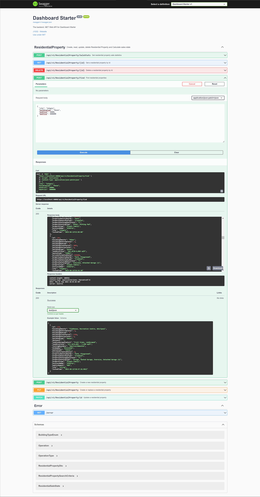
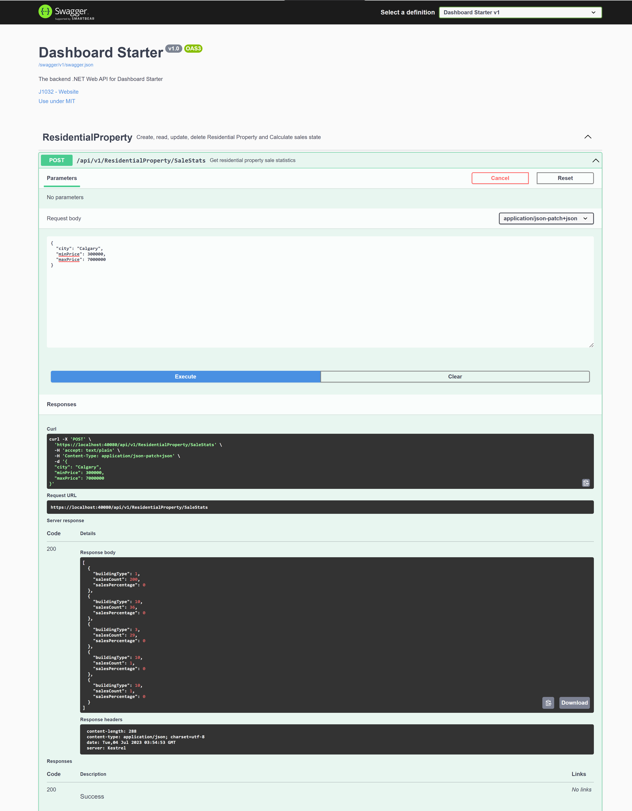
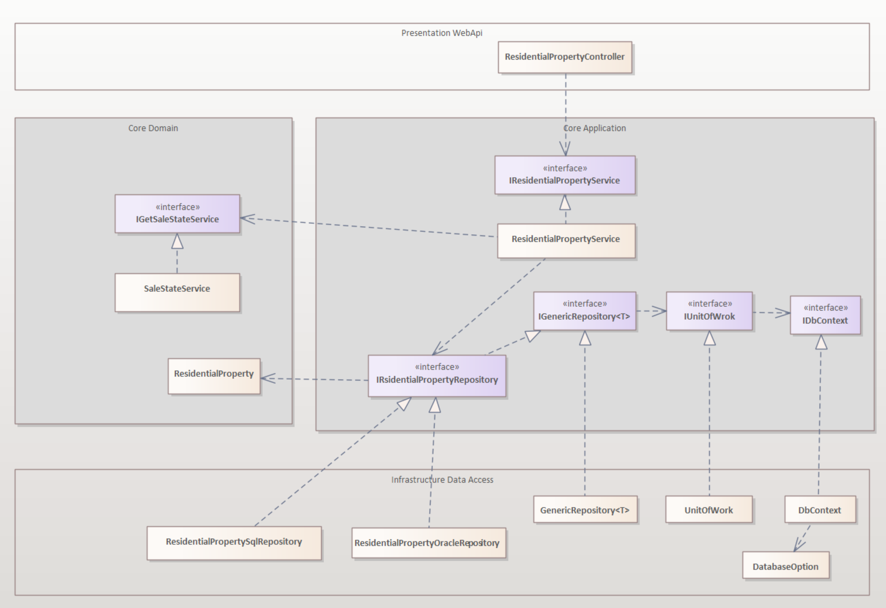

# .NET web api backend for Dashboard starter

## Features

- Built on .NET 7.0, MS SQL Server 2022
- Follows [Clean Architecture](https://blog.cleancoder.com/uncle-bob/2012/08/13/the-clean-architecture.html) Principles
- Repository Pattern with [Dapper](https://github.com/DapperLib/Dapper) 
- Integration with [Swagger](https://github.com/domaindrivendev/Swashbuckle.AspNetCore), [Serilog](https://serilog.net/), [AutoMapper](https://automapper.org/), [Newton Json(Json.NET)](https://www.newtonsoft.com/json)
- Unit tests with [xUnit](https://xunit.net/) and [Moq](https://github.com/moq/moq)

   
 

## Design

